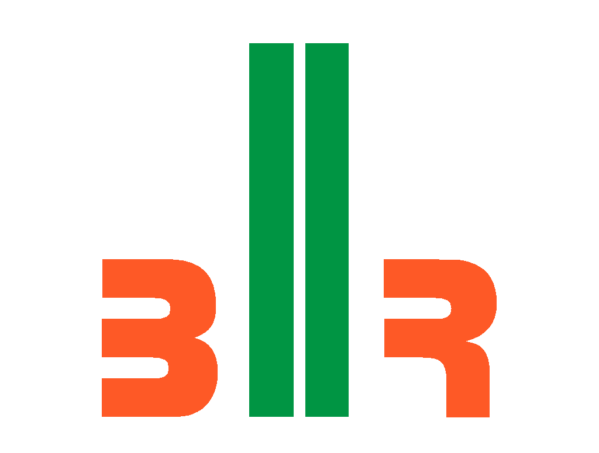

# 2018 Dashboard
This is FIRST Robotics Team 6098's 2018 robot dashboard, built off of the FRC Dashboard web driving dashboard framework.

## Setup
You'll need [`nodejs`](https://nodejs.org) & [`npm`](https://npmjs.com).

Before running the dashboard, you'll need to install the node dependencies by `cd`ing into the dashboard directory and running `npm install`.

### Configuration
* In `ui.js`, there are a bunch of key handler functions which controls the updating of control elements in the dashboard. Example NetworkTables key names are used, but you'll need to change them to match those used in your team's robot code for them to affect anything on your robot.

#### Camera feed
FRC Dashboard supports display of MJPG camera streams. Once you've created a stream (using WPILib's `CameraServer` class, [mjpg-streamer](https://robotpy.github.io/2016/01/14/mjpg-streamer-for-roborio/) (deprecated), or another method), update `style.css` to use the IP of your live camera feed. Usually this is something like `roborio-XXXX-frc.local:5800/?action=stream`, where `XXXX` is your team's number. The port may vary.

## Building
Some users may wish to compile their dashboard applications into standalone `.exe` or `.app` files.

Assuming the necessary setup steps have been performed, users may run `npm run-script package-[platform]`, where `[platform]` is `linux`, `mac`, or `win` according to the target platform, to pack the entire application into a single executable.

## Running
Connect to your robot's network if you haven't already. (If you're just testing the dashboard and don't currently need to use it with your robot, you can skip this step.)

While in the dashboard directory, run:

    npm start

This will open the dashboard application. Note that you can refresh the page and client-side updates will take effect; reopening the whole application is usually unnecessary.

It is recommended that while using the dashboard on your driver station, you close the top panel of the FRC DriverStation to make room for the dashboard.